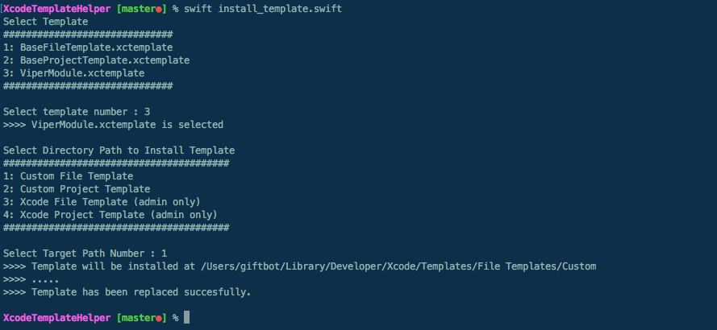

## Xcode Template Helper
Install Xcode Template with Ease.

- [How to install](#how-to-install)
  - [Using Script](#1-using-script-strongly-recommend)
  - [Manual](#2-manual)
- [Template Usage](#template-usage)
- [Create Your Own Template](#create-your-own-template)

## How to install

### 1. Using script (strongly recommend)

Just execute this command in terminal 

- to install in `User Custom Path`
```shell
swift install_template.swift
```

- to install in `Xcode application Path` 
```shell
sudo swift install_template.swift
```

- ##### ScreenShot
  


### 2. Manual

##### [ File Template ]

- to install in `User Custom Path`.
```shell
mkdir -p $HOME"/Library/Developer/Xcode/Templates/File Templates/Custom/[TemplateName].xctemplate/" && \
cp -R ./[TemplateName].xctemplate $HOME"/Library/Developer/Xcode/Templates/File Templates/Custom/"
```
** Copy & Paste above commands ** 
or copy `[TemplateName].xctemplate` manually to `$HOME"/Library/Developer/Xcode/Templates/File Templates/Custom"` Directory (File Templates/Custom directory may not exist. It's default)

- to install in `Xcode Application Path` 
```shell
tempDir=`xcode-select -p`"/Platforms/iPhoneOS.platform/Developer/Library/Xcode/Templates/File Templates/Source/" && \
sudo mkdir -p $tempDir/[TemplateName].xctemplate/ && \
sudo cp -R ./[TemplateName].xctemplate $tempDir
```
or 
Go to Application directory, select 'Show Package Contents' menu of Xcode application icon. Then browse to: `"/Platforms/iPhoneOS.platform/Developer/Library/Xcode/Templates/File Templates/Source/"`. and add `[TemplateName].xctemplate` to the directory.

<br>
##### [ Project Template ]

- to install in `User Custom Path`.
```shell
mkdir -p $HOME"/Library/Developer/Xcode/Templates/Project Templates/Custom/[TemplateName].xctemplate/" && \
cp -R ./[TemplateName].xctemplate $HOME"/Library/Developer/Xcode/Templates/Project Templates/Custom/"
```
** Copy & Paste above commands ** 
or copy `[TemplateName].xctemplate` manually to `$HOME"/Library/Developer/Xcode/Templates/Project Templates/Custom"` Directory (Project Templates/Custom directory may not exist. It's default)

- to install in `Xcode Application Path` 
```shell
tempDir=`xcode-select -p`"/Platforms/iPhoneOS.platform/Developer/Library/Xcode/Templates/Project Templates/iOS/Application" && \
sudo mkdir -p $tempDir/[TemplateName].xctemplate/ && \
sudo cp -R ./[TemplateName].xctemplate $tempDir
```
or 
Go to Application directory, select 'Show Package Contents' menu of Xcode application icon. Then browse to: `"/Platforms/iPhoneOS.platform/Developer/Library/Xcode/Templates/Project Templates/iOS/Application"`. and add `[TemplateName].xctemplate` to the directory.

Done. Now you can find your custom template in Xcode.
Congratulations! 🎉🎉

## Template Usage
##### 1. File Template -  ViperModule Template 


##### 2. Project Template - 

## Create Your Own Template
Do you want to create custom template? Do this.
```shell
sudo swift install_template.swift -g file
```
```shell
sudo swift install_template.swift -g project
```

These commands provide Base(File/Project)Template you can start with.
Base File Template is equal to ** Xcode Swift template. **
Base Project Template is eqaul to Xcode ** Single View Application template. **

1. Get base template
2. Edit
3. Install

👌👌

## TODOs
- [ ] Documentation for TemplateInfo.plist
- [ ] Add more templates
- [ ] Add option to script to remove template automatically

##### ** Any ideas? Issue & Pull request is encouraged. **

## License
** Xcode Template Helper ** is under the MIT license. See [LICENSE](LICENSE) for details.